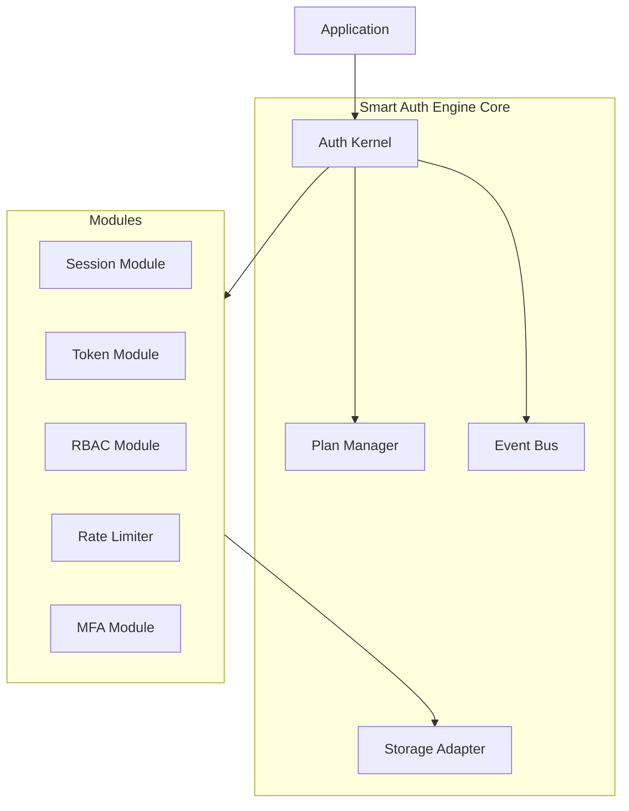

# 🔐 Smart Auth Engine


A production-ready, secure, and extensible authentication library for Node.js/TypeScript. Built on top of JWT with **stateful session intelligence**, refresh token rotation, Role-Based Access Control (RBAC), and Rate Limiting.

### Why Smart Auth Engine?

Most JWT libraries stop at token creation, whereas Smart Auth Engine adds session intelligence, feature gating, and modular extensibility — making it suitable for modern production systems.

## 🚀 Features

- **Advanced Session Management**: Tracks device info, IP, and revocation status (e.g., "Log out all devices").
- **Refresh Token Rotation**: Prevents replay attacks and token theft by rotating tokens on use.
- **Role-Based Access Control (RBAC)**: Assign roles (`admin`, `editor`, `user`) and restrict route access.
- **Rate Limiting**: Built-in brute-force protection to limit login attempts per IP.
- **Pluggable Storage**: Comes with In-Memory and Redis adapters (easily extensible).
- **Secure Defaults**: Uses `jose` for secure JWT handling and SHA-256 for token hashing.
- **TypeScript First**: Fully typed for robust integration.

> **Performance Note**: Modules are lazily initialized and only active if enabled, ensuring minimal runtime overhead.

## 🧠 Architecture Overview


> Note: Storage adapters are shared across all modules and power sessions, rate limits, and token metadata.

## 📦 Installation
> Requires Node.js 18+ and TypeScript 5+

```bash
npm install smart-auth-engine
```

## 🛠️ Quick Start

### 1. Initialize Auth

```typescript
import { createAuth, MemoryAdapter } from "smart-auth-engine";

const auth = createAuth({
  secret: "your-super-secret-key",
  accessTokenExpiry: "15m",
  refreshTokenExpiry: 60 * 60 * 24 * 7,
  storageAdapter: new MemoryAdapter(),
  // New: Specify your plan (gates features like RBAC and Rate Limiting)
  plan: "pro", 
});
```

### 2. Login User (with Role)

```typescript
// On login route
// Apply Rate Limiting (Requires 'starter' plan or higher)
app.post("/login", auth.rateLimiter({ windowSeconds: 60, maxRequests: 5 }), async (req, res) => {
  const { userId } = req.body;
  
  const { accessToken, refreshToken } = await auth.login(userId, {
    userAgent: req.headers["user-agent"],
    ip: req.ip,
    role: "admin"
  });

  res.json({ accessToken, refreshToken });
});
```

### 3. Protect Routes (Authentication)

```typescript
import express from "express";
const app = express();

app.get("/protected", auth.middleware(), (req, res) => {
  res.json({ user: req.user });
});
```

### 4. Role-Based Access Control (RBAC)
*Requires 'pro' plan*


```typescript
app.get("/admin", auth.middleware(), auth.requireRole("admin"), (req, res) => {
  res.json({ message: "Welcome Admin!" });
});
```

### 5. Refresh Token (Token Rotation)

```typescript
app.post("/refresh", async (req, res) => {
  const { refreshToken } = req.body;
  try {
    // Rotates the token (issues new pair, invalidates old family)
    const result = await auth.refresh(refreshToken);
    res.json(result); 
  } catch (error) {
    res.status(401).json({ error: "Invalid or expired refresh token" });
  }
});
```

### 6. Logout

```typescript
app.post("/logout", async (req, res) => {
  const { sessionId } = req.body;
  await auth.logout(sessionId);
  res.json({ message: "Logged out" });
});
```

### 7. Feature Plans

The engine enforces features based on the selected plan:

| Feature | Trial | Starter | Pro | Enterprise |
| :--- | :---: | :---: | :---: | :---: |
| **Sessions** | ✅ | ✅ | ✅ | ✅ | 
| **Smart Refresh** | ✅ | ✅ | ✅ | ✅ |
| **Rate Limiting** | ❌ | ✅ | ✅ | ✅ |
| **RBAC** | ❌ | ❌ | ✅ | ✅ |
| **MFA** (Coming Soon) | ❌ | ❌ | ❌ | ✅ |

> **Note:** If a restricted module or middleware is used on a lower plan, Smart Auth Engine throws a `PlanRestrictedError` during startup or request execution.

Configure the plan during initialization:
```typescript
const auth = createAuth({
    plan: "starter", // Enables Rate Limiting
    // ...
});
```

### 8. Configurable Modules

You can now enable/disable specific modules or add custom ones:

#### Core vs Optional Modules

**Core modules (always enabled):**
- `SessionModule`
- `TokenModule`

**Optional / Plan-gated modules:**
- `RateLimiterModule` (starter+)
- `RBACModule` (pro+)
- `MFAModule` (enterprise – coming soon)

```typescript
import { SessionModule, TokenModule } from "smart-auth-engine/modules";

// Example: Custom Audit Module
class AuditModule {
  name = "audit";

  initialize(ctx) {
    ctx.eventBus.on("auth.login", (e) => {
      console.log(`[Audit] User ${e.userId} logged in`);
    });
  }
}

const auth = createAuth({
    // ... config
    modules: [
        new SessionModule(), // Core
        new TokenModule(),   // Core
        new AuditModule(),   // Custom
    ]
});
```

### Redis Adapter
Recommended for production. Requires `ioredis`.
```typescript
import { RedisAdapter } from "smart-auth-engine";
const storage = new RedisAdapter("redis://localhost:6379");
```

## 🔧 Supported Frameworks

Smart Auth Engine works with any Node.js framework.

Official examples:
- **Express** (included)
- **Fastify** (coming soon)
- **NestJS** (coming soon)
- **Next.js Middleware** (planned)

## 🛡️ Security Best Practices
- **HTTPS**: Always use HTTPS in production.
- **HttpOnly Cookies**: Store refresh tokens in HttpOnly cookies to prevent XSS.
- **Secrets**: Rotate your JWT secrets periodically.

## 📄 License
ISC
